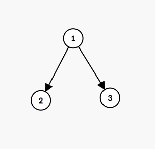

# binary-tree
Simple binary tree class using c++ stl smart pointers

# Linux compile and test:

- compile command:

```
g++ -o main test.cc -Wall -Wextra -std=c++17 -I <path_to_bintree.h>
``` 

There is a small program made for test purposes. It simply reads a 
a binary tree of real numbers and prints it to the console:


